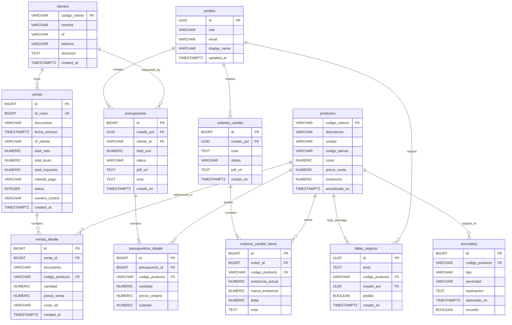

# El Serrucho GO


**El Serrucho GO** is a premium mobile dashboard for real-time inventory management and sales analytics for *Ferretería El Serrucho*. Built with a focus on performance, design quality, and robust data synchronization with an on-premise POS system.

---

## Table of Contents

- [Key Features](#key-features)
- [Tech Stack](#tech-stack)
- [Project Structure](#project-structure)
- [Database Architecture](#database-architecture--supabase-schema)
- [Getting Started](#getting-started)
- [Architecture Decisions](#architecture--decisions)
- [Changelog](#changelog)

---

## Key Features

| Feature | Description |
|---|---|
| **Real-time Analytics** | Daily sales trends, profit summaries, and top-selling product rankings |
| **Hybrid Sync Engine** | Bridges local POS `.dat` files with the Supabase cloud backend via a Python watcher |
| **RBAC** | Role-based access for Administrators and Employees with tailored interfaces |
| **Interactive Charts** | Dynamic sparklines and donut charts for financial health tracking |
| **Smart Alerts** | Gemini AI anomaly detection for inventory discrepancies and fraud signals |
| **State Persistence** | Global search and filter state preserved across navigation (Zustand) |
| **Responsive UI** | Dynamic font scaling and flexible layouts optimized for all screen sizes |
| **PDF Export** | Professional report generation for invoices and inventory lists |

---

## Tech Stack

### Frontend
- **Framework**: [Expo SDK 52](https://expo.dev/) (React Native)
- **Navigation**: [Expo Router](https://docs.expo.dev/router/introduction/) — file-based routing
- **State Management**: [Zustand](https://github.com/pmndrs/zustand) + [React Query (TanStack)](https://tanstack.com/query/latest)
- **Charts**: `react-native-gifted-charts`, `react-native-svg`
- **Lists**: `@shopify/flash-list`

### Backend
- **Platform**: [Supabase](https://supabase.com/)
- **Database**: PostgreSQL with Row Level Security (RLS)
- **Realtime**: Supabase Realtime for instant dashboard updates
- **Serverless**: Edge Functions for complex business logic (anomaly detection)

---

## Project Structure

```text
.
├── app/                          # Expo Router screens (file-based routing)
│   ├── (auth)/login.tsx          # Secure login screen
│   ├── (tabs)/
│   │   ├── _layout.tsx           # Custom FloatingTabBar orchestrator
│   │   ├── index.tsx             # Dashboard — KPI cards, sparklines, recent sales
│   │   ├── ventas.tsx            # Real-time sales viewer & detail sheet
│   │   ├── inventario.tsx        # Virtualized inventory (7k+ products)
│   │   ├── alertas.tsx           # Stock anomalies & AI fraud detector cards
│   │   ├── reportes.tsx          # Admin financial charts & product velocity
│   │   └── ordenes.tsx           # State-persisted physical change orders builder
│   ├── producto/[id].tsx         # Product detail & dynamic order controller
│   ├── perfil.tsx                # Session info, role, and logout
│   ├── _layout.tsx               # Global providers (QueryClient, AuthGuard, Fonts)
│   └── +not-found.tsx            # 404 fallback route
├── src/
│   ├── components/               # Atomic & presentational UI components
│   │   ├── SparklineChart.tsx    # Responsive SVG chart for 24h trends
│   │   ├── ProductRow.tsx        # Memoized FlashList item with layout scaling
│   │   ├── SyncBadge.tsx         # Three-state POS sync indicator
│   │   └── ...                   # DonutChart, AlertCard, StatCard, etc.
│   ├── hooks/                    # React Query & mutation hooks
│   │   ├── useProductos.ts       # Infinite query — 50 items/page
│   │   ├── useSyncStatus.ts      # Dual-path local widget fallback
│   │   └── ...                   # useVentasHoy, useAlertas, useUserRole, etc.
│   ├── lib/supabase.ts           # Typed Supabase client
│   └── theme/
│       ├── ThemeContext.tsx       # Dynamic context (colors, dimensions, formatUSD)
│       └── brands/el-serrucho.ts # Gold palette, dark background, USD currency
├── supabase/
│   ├── migrations/               # PostgreSQL migration chain (001-012)
│   └── functions/detect-anomalies/ # Gemini Flash 1.5 anomaly detection
└── eas.json                      # Expo Application Services profiles
```

---

## Database Architecture & Supabase Schema

The backend consists of a PostgreSQL database on Supabase, synchronized in real-time by an on-premise Python watcher that reads native POS `.dat` files.

### Entity-Relationship Diagram



### Key Database Conventions

> **Read-Only tables** — the app must never `INSERT`/`UPDATE`/`DELETE` on `productos`, `ventas`, `ventas_detalle`, `clientes`, or `tazas`. These are owned exclusively by the POS sync engine.

| Convention | Rule |
|---|---|
| **IVA 16%** | `productos.precio_venta` includes 16% IVA. To compare with `costo` (ex-IVA): `margin = ((precio_venta / 1.16) - costo) / (precio_venta / 1.16)` |
| **Currency** | All monetary values are stored in USD to avoid inflationary noise. The `tazas` table is an internal translation layer, never exposed in client UI. |
| **Costo sanitization** | `ventas_detalle.costo_str` is raw text from legacy POS schemas. Always parse with `safe_numeric(costo_str)` on the database side. |
| **Active transactions** | All sales aggregations must filter by `ventas.status = 1`. |

### Row Level Security (RLS)

- **Global read**: authenticated users can read `productos`, `clientes`, `ventas`, `ventas_detalle`, `tazas`, `anomalias`, `profiles`.
- **Ownership isolation**: `ordenes_cambio`, `presupuestos`, and their item tables are restricted to `creado_por = auth.uid()`.
- **Realtime publication**: `productos` and `fallas_negocio` are subscribed to `supabase_realtime` for instant UI updates.

---

## Getting Started

### Prerequisites

- Node.js (latest LTS)
- Expo Go app (physical device) or Android/iOS emulator
- A Supabase project with the migrations applied

### Environment Variables

Create a `.env.local` file at the root:

| Variable | Description |
|---|---|
| `EXPO_PUBLIC_SUPABASE_URL` | Your Supabase project URL |
| `EXPO_PUBLIC_SUPABASE_ANON_KEY` | Supabase anonymous (public) key |
| `EXPO_PUBLIC_WIDGET_API_URL` | *(Optional)* Local POS sync widget URL (e.g. `http://192.168.1.143:5000`) |

### Installation

```bash
git clone https://github.com/Gus2708/el-serrucho-go.git
cd el-serrucho-go
npm install
npm start
```

---

## Architecture & Decisions

- **Server-state first**: React Query handles all data fetching — caching, background sync, and stale-while-revalidate out of the box.
- **Typed routes**: Expo typed routes for compile-time navigation safety.
- **Versioned migrations**: All schema changes live in `/supabase/migrations` — sequential, reviewable, and reproducible across environments.
- **Atomic design**: Components are split into presentational (dumb) and container (smart) layers. FlashList handles virtualization for the 7k+ product inventory.

---

## Changelog

### v2.3
- **Quotes engine**: Added `presupuestos` + `presupuestos_detalle` tables with draft states, item builder, and PDF export.
- **Dynamic sales ranking**: Server-side RPC `get_top_productos(days_ago)` for adjustable time-range product performance.
- **Stockout log**: New `fallas_negocio` table lets employees flag missed sales in real-time, with Supabase Realtime alerts.
- **View restoration**: Backend migrations restoring `vw_ventas_detalle_usd` and fixing legacy document foreign key mappings.
- **Intelligent inventory**: Zustand global store persists search and filter state across navigation.
- **Robust navigation**: Smart back-navigation from product detail always returns to the correct inventory context.
- **Mobile optimization**: Dynamic font scaling (`adjustsFontSizeToFit`) and overflow handling for small screens (iPhone SE).
- **Sync indicators**: Real-time POS sync status badges based on last update timestamp.

---

<p align="center">
  Developed with care for <strong>Ferretería El Serrucho</strong>
</p>
