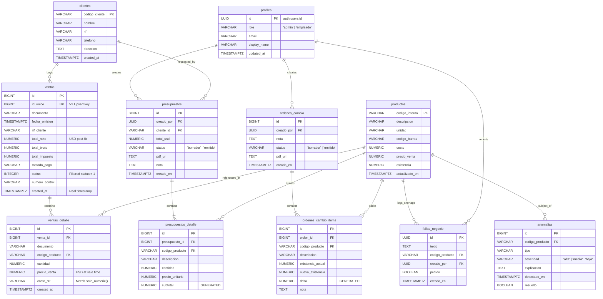

# 🛠️ El Serrucho GO


**El Serrucho GO** is a premium mobile dashboard designed for real-time inventory management and sales analytics for "Ferretería El Serrucho". Built with a focus on high performance, aesthetic excellence, and robust data synchronization.

---

## 🚀 Key Features

- **📊 Advanced Analytics**: Real-time sales monitoring with daily trends, profit summaries, and top-selling product insights.
- **🔄 Hybrid Sync Engine**: Seamless data synchronization between local on-site systems and the Supabase cloud backend.
- **🛡️ Role-Based Access (RBAC)**: Secure access control for Administrators and Employees with tailored interfaces.
- **📈 Interactive Visualizations**: Dynamic charts and sparklines for financial health tracking.
- **🔔 Smart Alerts**: Automated monitoring for inventory anomalies and critical system notifications.
- **💾 State Persistence**: Global search and filter parameters preserved across navigation (Zustand).
- **📱 Ultra-Responsive UI**: Optimized for all screen sizes with dynamic font scaling and flexible layouts.
- **📄 PDF Integration**: Professional report generation and document sharing (invoices, inventory lists).

---

## 🛠️ Tech Stack

### Frontend
- **Framework**: [Expo SDK 52](https://expo.dev/) (React Native)
- **Navigation**: [Expo Router](https://docs.expo.dev/router/introduction/) (File-based routing)
- **State Management**: [Zustand](https://github.com/pmndrs/zustand) & [React Query](https://tanstack.com/query/latest)
- **Visuals**: `react-native-gifted-charts`, `react-native-svg`
- **Performance**: `@shopify/flash-list`

### Backend
- **Platform**: [Supabase](https://supabase.com/)
- **Database**: PostgreSQL with Row Level Security (RLS)
- **Real-time**: Supabase Realtime for instant dashboard updates
- **Serverless**: Edge Functions for complex business logic

---

## 📂 Project Structure

```text
.
├── app/                      # Expo Router screens and file-based navigation
│   ├── (auth)/               # User authentication flows
│   │   └── login.tsx         # Secure login screen
│   ├── (tabs)/               # Core application shell with floating tab bar
│   │   ├── _layout.tsx       # Custom FloatingTabBar orchestrator
│   │   ├── index.tsx         # Dashboard with Sparklines, KPI cards, and recent sales
│   │   ├── ventas.tsx        # Real-time sales viewer & deep detail sheet
│   │   ├── inventario.tsx    # Optimized virtualized 7k+ product inventory
│   │   ├── alertas.tsx       # Stock anomalies & Gemini AI fraud/theft detector cards
│   │   ├── reportes.tsx      # Admin financial charts and product velocity distributions
│   │   └── ordenes.tsx       # State-persisted physical change orders builder
│   ├── producto/[id].tsx     # Product detail sheet & dynamic order controller
│   ├── perfil.tsx            # Session status, role info, and logout
│   ├── _layout.tsx           # Global Providers (QueryClient, AuthGuard, Fonts)
│   └── +not-found.tsx        # Fallback 404 route
├── src/                      # Source code for React Native
│   ├── components/           # Atomic & Presentational UI Components
│   │   ├── SparklineChart.tsx# Responsive SVG chart for 24h dashboard trends
│   │   ├── ProductRow.tsx    # Memoized flat list item with custom layout scaling
│   │   ├── SyncBadge.tsx     # Three-state POS sync indicator (Green/Yellow/Red)
│   │   └── ...               # DonutChart, AlertCard, StatCard, etc.
│   ├── hooks/                # Query & Mutation custom integration hooks
│   │   ├── useProductos.ts   # Infinite query paginated provider (50 items/page)
│   │   ├── useSyncStatus.ts  # Dual-path local widget fallback execution
│   │   └── ...               # useVentasHoy, useAlertas, useUserRole, etc.
│   ├── lib/                  # Infrastructure configuration
│   │   └── supabase.ts       # Typed Supabase client with exact DB model typings
│   └── theme/                # Brand identity & design tokens
│       ├── ThemeContext.tsx  # Dynamic context provider (colors, dimensions, formatUSD)
│       └── brands/           # Specific brand palettes
│           └── el-serrucho.ts# El Serrucho Gold, dark background, and USD currency settings
├── supabase/                 # Cloud database infrastructure
│   ├── migrations/           # PostgreSQL migration chain (001 to 012)
│   └── functions/            # Edge serverless functions
│       └── detect-anomalies/ # Gemini Flash 1.5 anomaly detection logic
└── eas.json                  # Expo Application Services configuration profiles
```

---

## 🗄️ Database Architecture & Supabase Schema

The backend architecture consists of a PostgreSQL database on Supabase synchronized in real-time by an on-premise Python file-watcher widget observing native POS `.dat` files.

### 📊 Entity-Relationship Diagram



### 🔑 Key Database Conventions

1. **Read-Only / POS Ownership**: The mobile app **MUST NEVER** perform direct write actions (`INSERT`/`UPDATE`/`DELETE`) on `productos`, `ventas`, `ventas_detalle`, `clientes`, or `tazas`. These tables are strictly managed by the local POS Sync engine.
2. **IVA 16% Rule**: `productos.precio_venta` includes Venezuela's standard 16% IVA. When calculating gross margins or performing comparisons with `costo` (which is ex-IVA), always divide by `1.16` first:
   $$\text{Margin Pct} = \frac{(\text{precio\_venta} / 1.16) - \text{costo}}{\text{precio\_venta} / 1.16}$$
3. **Monetary Standardization**: All prices are natively stored or post-processed into USD ($) to avoid inflationary noise. The `tazas` table operates as an internal server translation layer and is never exposed in client UI calculations.
4. **Costo Sanitization**: Since `ventas_detalle.costo_str` is imported as raw unstructured text from older POS schemas (potentially carrying commas or text characters), it must always be parsed using the database helper `safe_numeric(costo_str)` when performing database-side operations.
5. **Active Transactions**: For sales metrics, `ventas.status = 1` filters must be strictly maintained in all aggregations and analytical queries.

### 🛡️ Row Level Security (RLS) & Publications

Row Level Security is enabled on **every** table in the database to prevent unauthorized access:
- **Global Read Policies**: Authenticated employees and admins have shared read privileges (`TO authenticated USING (true)`) on `productos`, `clientes`, `ventas`, `ventas_detalle`, `tazas`, `anomalias`, `profiles`, and all analytical views.
- **Ownership Isolation**: `ordenes_cambio`, `ordenes_cambio_items`, `presupuestos`, and `presupuestos_detalle` are fully restricted by creator identity policies (`creado_por = auth.uid()`), ensuring draft orders and quotes remain strictly private to the creating employee.
- **Fallas de Negocio**: Accessible globally for reading and writing among all authenticated staff (`fallas_negocio` uses RLS to allow inserts and updates under the `authenticated` role).
- **Realtime publication**: `productos` and `fallas_negocio` tables are subscribed to the `supabase_realtime` publication, triggering instant UI reactive updates.

---

## ⚙️ Getting Started

### Prerequisites
- Node.js (Latest LTS)
- Expo Go (on physical device) or Android/iOS Emulator
- Supabase Project

### Installation

1. **Clone the repository**
   ```bash
   git clone https://github.com/Gus2708/el-serrucho-go.git
   cd el-serrucho-go
   ```

2. **Install dependencies**
   ```bash
   npm install
   ```

3. **Configure Environment Variables**
   Create a `.env.local` file in the root:
   ```env
   EXPO_PUBLIC_SUPABASE_URL=https://your_supabase_project_ref.supabase.co
   EXPO_PUBLIC_SUPABASE_ANON_KEY=your_supabase_anon_public_key
   EXPO_PUBLIC_WIDGET_API_URL=http://192.168.1.143:5000 # Optional local sync widget
   ```

4. **Start the development server**
   ```bash
   npm start
   ```

---

## 🏗️ Architecture & Decisions

- **Server-State First**: We leverage React Query for all data fetching to ensure optimal caching and background synchronization.
- **Typed Routes**: Using Expo's new typed routes for maximum developer productivity and runtime safety.
- **Modular Database**: The database is managed via versioned migrations in the `/supabase` folder, ensuring schema consistency across environments.

---

## 🤝 Contributing

1. Fork the Project
2. Create your Feature Branch (`git checkout -b feature/AmazingFeature`)
3. Commit your Changes (`git commit -m 'Add some AmazingFeature'`)
4. Push to the Branch (`git push origin feature/AmazingFeature`)
5. Open a Pull Request

---

## 📄 License

Distributed under the MIT License. See `LICENSE` for more information.

---

## ✨ Recent Improvements (v2.3)

- **📄 Presupuestos (Quotes Engine)**: Added a comprehensive quotes module (`presupuestos` and `presupuestos_detalle` tables) with draft states, item builders, and PDF export integration.
- **📉 Dynamic Sales Ranking**: Integrated a server-side dynamic analytics RPC function `get_top_productos(days_ago)` allowing adjustable time-range products performance ranking.
- **⚠️ Fallas de Negocio**: Added a dedicated log for stockout reporting (`fallas_negocio` table) to let employees flag missed sales opportunities in real-time, coupled with instant Supabase Realtime alerts.
- **🔩 Views Native Restore**: Successfully completed backend migrations restoring views to native USD and fixing old document foreign key mappings (`vw_ventas_detalle_usd`).
- **Inventario Inteligente**: Implementación de un store global (Zustand) para persistir búsquedas y filtros al navegar entre pantallas.
- **Navegación Robusta**: Lógica de retorno inteligente en el detalle de productos para asegurar que el usuario siempre regrese al inventario.
- **Optimización Mobile**: Ajuste de tipografías dinámicas (`adjustsFontSizeToFit`) y manejo de desbordamientos en pantallas pequeñas (iPhone SE, etc).
- **Sincronización Mejorada**: Integración de indicadores de estado en tiempo real basados en la última actualización del POS.

---

<p align="center">
  Developed with ❤️ for <strong>Ferretería El Serrucho</strong>
</p>
