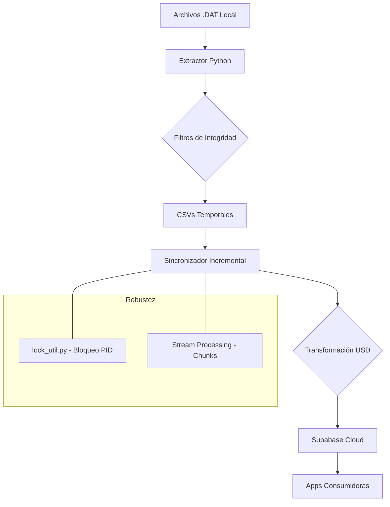

# 🏗️ Arquitectura de Sincronización de Datos - El Serrucho

Este documento describe el flujo de datos desde el sistema contable local **HybridLite** hasta la base de datos **Supabase**, detallando las transformaciones y filtros aplicados.

## 🔄 Flujo General de Datos

## 1. Extracción y Filtrado
El sistema no sube los archivos `.dat` directamente. Un motor de extracción intermedio (`extraer_ventas.py` y `actualizar_inventario.py`) realiza las siguientes tareas:

*   **Ventas**: Se filtran únicamente las **Facturas (Tipo 11)**. Se descartan Notas de Entrega, presupuestos y facturas anuladas (`Status 4`).
*   **Inventario**: Se mapean códigos, descripciones y existencias. Se asegura que el precio extraído sea el **PVP Final** (incluyendo impuestos).

## 2. Transformación de Moneda (USD)
Para mantener la integridad con los reportes de gestión, el motor de sincronización aplica una lógica de conversión:

*   **Tasa Dinámica**: Cada transacción de venta se convierte a USD utilizando la tasa de cambio (`THT_FACTORREFERENCIAL`) grabada por el sistema en el momento exacto de la venta.
*   **Consistencia**: Esto permite que las aplicaciones consuman montos en dólares que coinciden centavo a centavo con los reportes de HybridLite, independientemente de la fluctuación del BCV.

## 3. Sincronización Incremental y Robustez
Para evitar saturar la conexión a internet y garantizar la estabilidad del sistema:
*   **Hashing MD5**: El sistema genera una "huella digital" de cada registro local.
*   **Detección de Cambios**: Solo se envían a la nube los registros cuya huella haya cambiado o registros nuevos.
*   **Batch Updates**: Los datos se envían en lotes de 1,000 registros para optimizar la velocidad de la API de Supabase.
*   **Gestión de Bloqueos (PID)**: Mediante `lock_util.py`, el sistema asegura que solo una instancia de sincronización esté activa a la vez, evitando corrupción de archivos temporales o duplicación de carga.
*   **Procesamiento por Flujos (Streaming)**: El motor lee los archivos CSV en bloques (`chunk_size`), permitiendo procesar archivos de ventas de cientos de megabytes sin exceder el uso de memoria RAM de la PC local.

## 4. Estructura de Datos en la Nube (Consumo)

### Tabla `productos`
*   `precio_venta`: Precio en USD con IVA incluido.
*   `existencia`: Cantidad física disponible.

### Tabla `ventas`
*   `total_neto`: Monto total cobrado en USD.
*   `total_bruto`: Subtotal antes de impuestos en USD.
*   `total_impuesto`: Monto de IVA en USD.
*   `fecha_emision`: Fecha de la factura (YYYY-MM-DD).

### Tabla `ventas_detalle`
*   `precio_venta`: Precio unitario del producto en USD al momento de la venta.
*   `cantidad`: Cantidad vendida.

## 5. Glosario de Tipos (HybridLite)
Para referencia al auditar datos:
*   **Tipo 11**: Factura de Venta (Consolidado en Nube).
*   **Tipo 10**: Nota de Entrega (Excluido).
*   **Status 1**: Completada.
*   **Status 4**: Anulada (Excluido).

---
*Última actualización: 07 de Mayo de 2026*
